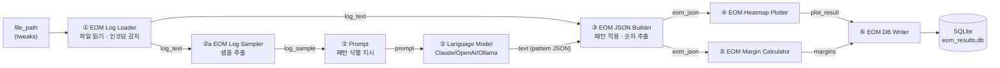

# EOM Analysis Flow — 컴포넌트 단위 재구성 (Langflow 1.9.1)

각 기능을 **단일 책임(single-responsibility) 컴포넌트**로 나누고,
한 컴포넌트의 **출력이 다음 컴포넌트의 입력**으로 흐르도록 재구성한다.
이 flow는 Langflow의 네이티브 포맷인 **JSON 파일**(`eom_analysis_flow.json`)로
export/import 된다.

## 파일 형식 — 왜 JSON인가
- Langflow flow의 저장/이식 포맷은 **`.json`** 이다.
  - UI: `Export` → `.json` 다운로드 / `Import` → `.json` 업로드
  - API: `POST /api/v1/flows`(생성) 또는 UI 조립 후 `flow_id`로 실행
- 최상위 구조:
  ```json
  { "name": "...", "description": "...", "id": "<uuid>",
    "data": { "nodes": [ ... ], "edges": [ ... ] } }
  ```
  - `nodes[*].data.node.template` : 컴포넌트 입력 필드 + 임베드 코드(`code`)
  - `nodes[*].data.node.outputs`  : 컴포넌트 출력 정의
  - `edges[*].sourceHandle/targetHandle` : 출력→입력 연결
    (Langflow는 핸들 문자열에서 `"` 를 `œ` 문자로 치환해 인코딩)
- 본 저장소에서는 `flows/build_flow_json.py`로 그래프를 코드로 정의해
  `flows/eom_analysis_flow.json`을 재생성한다 (수기 편집보다 오류가 적음).

## 데이터 흐름 (재구성)



**핵심 재구성 포인트** — 요청하신 "parser 컴포넌트 출력이 LLM 입력으로" 구조:
파일 읽기(I/O)를 **① Log Loader**로 분리하고, 그 `log_text` 출력이
LLM 앞단인 **②a Sampler**(→ Prompt → LLM)와, 후단인 **③ JSON Builder**로
각각 edge로 전달된다. LLM은 로그 전체가 아니라 Sampler가 만든 **샘플**만 받는다.

## 컴포넌트 명세 (입력 → 출력 계약)

| # | 컴포넌트 | 종류 | 입력 (source) | 출력 (→ target) | 코드 파일 | 상태 |
|---|---------|------|--------------|-----------------|----------|------|
| ① | **EOM Log Loader** | 커스텀 | `file_path` (tweaks) | `log_text` : Message → ②a, ③ | `eom_log_loader.py` | **신규** |
| ②a | **EOM Log Sampler** | 커스텀 | `log_text` (①), `head_lines` | `log_sample` : Message → Prompt | `eom_log_sampler.py` | **I/O 변경** |
| ② | **Prompt** | 내장 | `log_sample` (②a), `template` | `prompt` : Message → LLM | (Langflow 내장) | 조립 |
| ② | **Language Model** | 내장 | `input_value` (Prompt), `provider/model/api_key` | `text` : Message(패턴 JSON) → ③ | (Langflow 내장) | 조립 |
| ③ | **EOM JSON Builder** | 커스텀 | `llm_patterns` (②), `log_text` (①), `source_file`·`llm_model` (tweaks), `output_dir` | `eom_json` : Data → ④, ⑤ | `eom_json_builder.py` | **I/O 변경** |
| ④ | **EOM Heatmap Plotter** | 커스텀 | `eom_json` (③), `output_dir`, `dpi` | `plot_result` : Data → ⑥ | `eom_heatmap_plotter.py` | 유지 |
| ⑤ | **EOM Margin Calculator** | 커스텀 | `eom_json` (③), `fail_width_ui`, `fail_height_mv` | `margins` : Data → ⑥ | `eom_margin_calculator.py` | 유지 |
| ⑥ | **EOM DB Writer** | 커스텀 | `margins` (⑤), `plot_result` (④), `db_url` | `result` : Data | `eom_db_writer.py` | 유지 |

- 공용 코어 `eom_eye_core.py` : ④/⑤가 좌표변환·중심탐지·마진·시각화 로직을 공유
  (이미지 표기 마진 = DB 저장 마진 일치 보장). 컴포넌트가 아니라 import 모듈.

### ② Prompt 컴포넌트에 넣을 내용
Prompt 노드의 `template` 에는 `flows/prompts/eom_pattern_prompt.txt` 내용을 그대로 넣는다.
(flow JSON 에도 이 텍스트가 이미 임베드되어 있음.) 핵심 구성:
- **역할 지정** + 찾을 정보 5종을 **유사 키워드**와 함께 제시
  (voltage↔amp, timing↔phase, error↔errs, lane↔CH, MaxSteps↔MaxPhase 등)
- **정규식 규칙**: `data_pattern` 은 named group `(?P<timing>)(?P<voltage>)(?P<error>)` 필수,
  `(?P<lane>)` 선택 / `config_pattern` 은 4개 축 그룹 / JSON이므로 역슬래시는 `\\d` 처럼 2번.
- **few-shot 예시 2종** (표준 QC 포맷 + 키워드가 다른 벤더 변형) — 입력 로그와
  기대 출력 JSON을 함께 제시하여 유사어 인식·형식을 학습시킴.
- **출력 형식 고정**: 마크다운·설명 금지, `{{"config_pattern": ..., "data_pattern": ..., "default_fill": 63}}` JSON만.
- **변수**: `{log_sample}` (②a Sampler 출력) 만 실제 치환 변수. 나머지 리터럴 중괄호는
  Langflow Prompt 문법상 `{{ }}` 로 이스케이프되어 있음.

> 검증됨: 두 예시의 정규식은 실제 파서로 config 4필드 + 데이터 3행을 정확히 추출하고,
> 기대 출력 JSON은 `③ JSON Builder`의 응답 파서(`parse_llm_patterns`)와 동일 규칙으로 파싱된다.

### 기존 대비 변경 요약
- **분리(신규)**: 파일 읽기를 `EOMLogLoader`로 독립 → 이중 파일 읽기 제거, 배선 명확화.
- **②a Sampler**: 입력 `file_path` → `log_text`(① 출력) 로 변경.
- **③ JSON Builder**: 입력 `file_path` → `log_text`(① 출력) + `source_file`(파일명, tweaks) 로 변경.
- **알고리즘 로직은 전부 동일** (파싱 규칙/마진 계산/시각화 불변). 컴포넌트 경계와 I/O만 재구성.
- **Frontend tweaks** (`frontend/main.py`): `EOMLogLoader.file_path`,
  `EOMJsonBuilder.{source_file, llm_model}` 로 갱신 (`log_text`는 edge 전달이라 tweaks 불필요).

## Langflow 적용 절차
1. 커스텀 컴포넌트 로드: `LANGFLOW_COMPONENTS_PATH=./langflow_components langflow run`
   (④/⑤는 `eom_eye_core.py` import — 같은 디렉터리에 존재해야 함)
2. `flows/eom_analysis_flow.json` 을 UI에서 **Import**.
3. **Prompt / Language Model** 내장 노드는 버전별 템플릿이 크므로, import 후
   경고가 있으면 팔레트에서 새로 끌어와 재배선 권장. (커스텀 6종·전체 배선은 JSON에 포함)
4. 실행 후 UI에서 실제 **노드 ID**를 확인해 Frontend `build_tweaks` 키와 일치시킨다.
   Langflow가 노드 ID에 접미사를 붙일 수 있으므로(예: `EOMLogLoader-a1B2c`),
   ID를 고정하거나 tweaks 키를 export된 ID로 교체한다. → **E2E 1순위 확인 항목**

## 재생성
```bash
python3 flows/build_flow_json.py   # → flows/eom_analysis_flow.json
```
